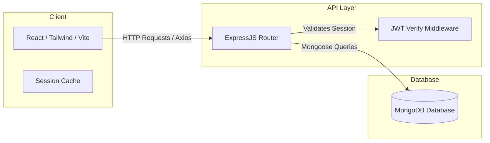

# 🚗 ParkEase - Smart Parking Management System

[](https://react.dev/)
[](https://vitejs.dev/)
[](https://tailwindcss.com/)
[](LICENSE)
[](https://github.com/)

ParkEase is a modern, responsive web application designed for parking businesses and vehicle owners to streamline parking management, reservation, and spot allocations. The application provides an interactive client portal to browse available locations, manage registered vehicles, and book/confirm reservations using dynamic forms.

---

## 📖 Table of Contents

- [🚀 Key Features](#-key-features)
  - [Client Portal](#client-portal)
  - [Management & Administration](#management--administration)
  - [Authentication Flow](#authentication-flow)
- [🛠️ Tech Stack](#️-tech-stack)
- [📂 Project Structure](#-project-structure)
- [🚀 Getting Started](#-getting-started)
  - [Prerequisites](#prerequisites)
  - [Installation & Setup](#installation--setup)
- [🔑 Demo & Testing Credentials](#-demo--testing-credentials)
- [🛣️ Application Routing Map](#️-application-routing-map)
- [🧬 Mock Data & State Management](#-mock-data--state-management)
- [🔮 Future Architecture (Roadmap to MERN)](#-future-architecture-roadmap-to-mern)
- [📄 License](#-license)

---

## 🚀 Key Features

### Client Portal
- **Dashboard Overview**: A central hub summarizing active reservations, total spent, vehicle counts, and recent activity history.
- **My Vehicles**: A vehicle registry to add, edit, and remove personal vehicles with custom metadata (Make, Model, Year, Plate Number, Color).
- **Interactive Spot Search & Filter**: Component templates ready to search spots by location, duration, hourly rate, and vehicle type.
- **Reservation Pipeline**:
  - `ReservationForm`: Step-by-step reservation configuration (Duration, Date/Time, Vehicle assignment).
  - `ReservationConfirm`: Order breakdown showing rates, location metadata, and confirmation controls.
  - `BookingSuccess`: Success card with transaction confirmation summaries.

### Management & Administration
- **Admin Dashboard**: Portal template for parking businesses to view system-wide stats, monitor occupancy rates, and handle administrative report generation.

### Authentication Flow
- **Simulated Auth Service**: A stateful Context provider that persists user sessions to `localStorage`.
- **Validation**: Detailed client-side verification on login/signup forms.
- **Success & Error Portals**: Custom page routing representing successful signups, active logins, or fallback credentials errors.

---

## 🛠️ Tech Stack

- **Core Framework**: [React 18.2.0](https://react.dev/) (Functional components with Hooks)
- **Build System**: [Vite 7.3.0](https://vitejs.dev/) (Fast Hot Module Replacement & production bundling)
- **Styling**: [Tailwind CSS 3.3.5](https://tailwindcss.com/) with PostCSS configuration
- **Animations**: [Framer Motion 10.16.4](https://www.framer.com/motion/) (configured for micro-interactions)
- **Routing**: [React Router DOM 6.20.0](https://reactrouter.com/) (declarative browser navigation)
- **Session Management**: Native React Context API with state synchronization to `window.localStorage`

---

## 📂 Project Structure

```text
ParkEase_WebAppForParkingBusinesses/
├── README.md                  # Root documentation
└── frontend/                  # Web App Frontend Core
    ├── package.json           # npm dependencies and scripts
    ├── postcss.config.js      # PostCSS setup for Tailwind CSS
    ├── tailwind.config.js     # Tailwind themes, variables, and brand colors
    ├── vite.config.js         # Vite dev server and build specs
    ├── index.html             # Entry point template
    └── src/
        ├── App.jsx            # Core layout wrapper and React Routes
        ├── main.jsx           # App bootstrapping
        ├── index.css          # Tailwind base directives and fallback styles
        ├── context/
        │   └── AuthContext.jsx # LocalStorage session manager & auth context provider
        ├── data/
        │   ├── mockSlots.js   # Slot structures, pricing models, and locations
        │   └── mockUserData.js# User profiles, statistics, and registered vehicles
        ├── components/
        │   ├── Auth/
        │   │   └── ProtectedRoute.jsx # Route guard matching authenticated users
        │   ├── Dashboard/
        │   │   ├── DashboardHeader.jsx  # Main application dashboard header
        │   │   ├── DashboardLayout.jsx  # Sidebar + Header wrapper layout
        │   │   ├── DashboardSidebar.jsx # Nav links with custom SVG icons
        │   │   └── QuickStats.jsx       # Grid stats indicators
        │   ├── Search/
        │   │   ├── SearchForm.jsx       # Advanced spot filtering interface
        │   │   └── SlotCard.jsx         # Card component showing parking space information
        │   ├── Navigation/
        │   │   └── Navbar.jsx           # Global landing page responsive header
        │   ├── Hero/ | Features/ | HowItWorks/ | Statistics/ | Footer/
        │   │   └── [Components].jsx     # Landing page modular layout sections
        └── pages/
            ├── LandingPage.jsx          # Public facing promotional landing page
            ├── UserDashboardPage.jsx    # Client dashboard homepage
            ├── MyVehiclesPage.jsx       # Vehicle management interface
            ├── Admin/
            │   └── AdminDashboardPage.jsx # Business analytics dashboard template
            ├── Auth/
            │   ├── LoginPage.jsx        # Login panel containing demo details
            │   ├── SignupPage.jsx       # Account registration panel
            │   ├── LoginSuccessPage.jsx  # Landing redirect on successful auth
            │   ├── SignupSuccessPage.jsx # Landing redirect on successful registration
            │   └── LoginErrorPage.jsx   # Error screen for invalid credentials
            └── Reservation Flow/
                ├── ReservationForm.jsx  # Reservation scheduler wizard
                ├── ReservationConfirm.jsx # Billing and details checkout summary
                └── BookingSuccess.jsx   # Post-transaction confirmation screen
```

---

## 🚀 Getting Started

### Prerequisites

Ensure you have the following installed:
- **Node.js** (v16.0.0 or higher recommended)
- **npm** (v8.0.0 or higher)

### Installation & Setup

1. **Clone the Repository**
   ```bash
   git clone <repository-url>
   cd ParkEase_WebAppForParkingBusinesses
   ```

2. **Navigate to the Frontend Directory**
   ```bash
   cd frontend
   ```

3. **Install Project Dependencies**
   ```bash
   npm install
   ```

4. **Start the Development Server**
   ```bash
   npm run dev
   ```
   The local development server will start on `http://localhost:5173` (or the next available port).

5. **Build for Production**
   ```bash
   npm run build
   ```
   Outputs production-optimized bundle files into the `dist/` folder.

---

## 🔑 Demo & Testing Credentials

To explore the private client dashboard features without registering a new account, use the following preloaded credentials on the **Login Page**:

- **Email**: `praveen@parkease.com`
- **Username**: `praveen`
- **Password**: `password123`

---

## 🛣️ Application Routing Map

The client navigation uses React Router DOM. Below is a map of the currently configured paths:

| Path | Component | Auth Guarded? | Purpose |
| :--- | :--- | :--- | :--- |
| `/` | `LandingPage` | No | Marketing website home |
| `/login` | `LoginPage` | No | Authentication gateway |
| `/signup` | `SignupPage` | No | New user account creator |
| `/login-success` | `LoginSuccessPage` | No | Validation success portal |
| `/signup-success` | `SignupSuccessPage`| No | User onboarding success portal |
| `/login-error` | `LoginErrorPage` | No | Fallback screen for failed attempts |
| `/user-dashboard` | `UserDashboardPage`| **Yes** | Client statistics & central portal |
| `/reservation/details`| `ReservationForm` | No | Spot reservation configuration |
| `/reservation/confirm`| `ReservationConfirm`| No | Cost summary check and billing approval |
| `/reservation/success`| `BookingSuccess` | No | Transaction success indicator |

---

## 🧬 Mock Data & State Management

To allow local frontend-only testing and validation, the system replicates server states using static structures:

- **User Context (`AuthContext.jsx`)**: Coordinates login, logout, session loading indicators, and user object propagation via a custom hook `useAuth()`. Session state persists across window refreshes via:
  ```javascript
  localStorage.setItem('parkease_user', JSON.stringify(userData))
  ```
- **Slot Schema (`mockSlots.js`)**: Lists location models, available states, hourly/daily price rates, and category types (`Car`, `SUV`, `Motorcycle`, `Truck`, `Van`).
- **Vehicle Profiles (`mockUserData.js`)**: Pre-populates the vehicle grid with test profiles like a Silver Toyota Camry or a Red Honda CBR600.

---

## 🔮 Future Architecture (Roadmap to MERN)

To migrate this frontend prototype into a production MERN Stack application, the following backend architecture should be established:



### Steps to Integrate: 
1. **Server Setup**: Create a `/backend` directory containing a Node.js + Express app running on an independent port (e.g., `5000`).
2. **Database Integration**: Connect to a MongoDB cluster using [Mongoose ODM](https://mongoosejs.com/) to map user schemas, vehicle records, and reservation transactions.
3. **API Endpoints**: Replace mock imports (`mockSlots.js`, `mockUserData.js`) with active dynamic `fetch`/`axios` requests to endpoints such as:
   - `POST /api/auth/login` - returns a Signed JSON Web Token (JWT).
   - `GET /api/slots?location=Downtown` - queries dynamic space states.
   - `POST /api/reservations` - reserves a spot and decreases occupancy in the DB.
4. **CORS and Proxy Configuration**: Configure CORS on the Express server, or set up a client proxy in `vite.config.js` to route backend queries seamlessly:
   ```javascript
   server: {
     proxy: {
       '/api': 'http://localhost:5000'
     }
   }
   ```

---

## 📄 License

This project is licensed under the MIT License - see the [LICENSE](LICENSE) file for details.
